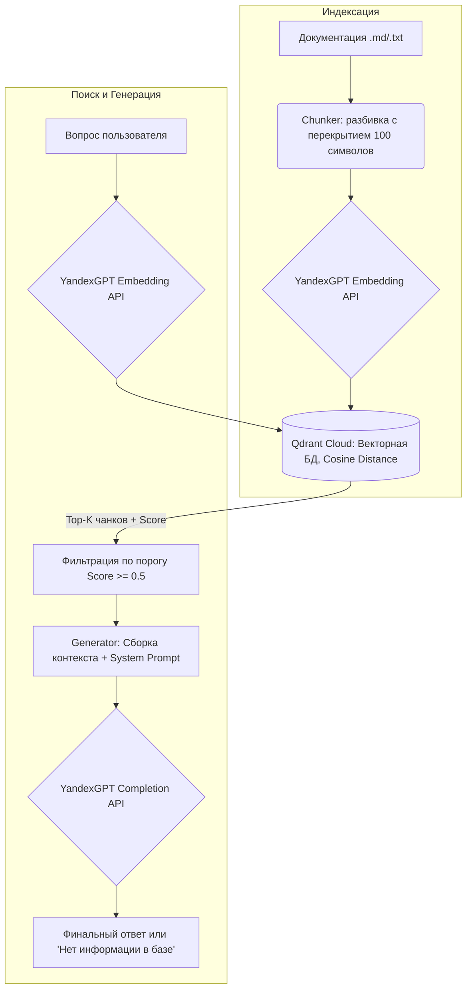

# RAG Knowledge Assistant

Интеллектуальный ассистент по документации инструмента «Excel-мерджер файлов Яндекс Маршрутов». Система использует подход Retrieval-Augmented Generation (RAG) для поиска релевантных фрагментов документации и генерации точных ответов на естественном языке без галлюцинаций.

## Архитектура

Система состоит из двух основных пайплайнов: индексации и поиска с генерацией.



## Технологический стек

- Язык: Python 3.10+
- LLM и эмбеддинги: YandexGPT (Yandex Cloud Foundation Models)
- Векторная база данных: Qdrant Cloud
- Библиотеки: qdrant-client, requests, python-dotenv
- Интерфейс: CLI (argparse)

## Установка и настройка

1. Клонируйте репозиторий:
   ```bash
   git clone https://github.com/Kris-Tsilik/rag-knowledge-assistant.git
   cd rag-knowledge-assistant
   ```

2. Установите зависимости:
   ```bash
   pip install -r requirements.txt
   ```

3. Настройте переменные окружения. Создайте файл `.env` в корне проекта на основе `.env.template` и заполните его реальными ключами:
   ```env
   YANDEX_API_KEY=ваш_api_ключ_сервисного_аккаунта
   YANDEX_FOLDER_ID=ваш_id_каталога_yandex_cloud
   QDRANT_URL=https://ваш-кластер.cloud.qdrant.io:6333
   QDRANT_API_KEY=ваш_api_ключ_qdrant
   ```
   Примечание: Файл `.env` добавлен в `.gitignore` и не передается в репозиторий.

## Использование

Проект предоставляет единый CLI-интерфейс с тремя основными командами.

1. Индексация документа (разбивает файл, создает эмбеддинги и загружает в Qdrant):
   ```bash
   python src/main.py index merger_guide.md
   ```

2. Сырой поиск (показывает топ-3 чанка и их скоринг для отладки):
   ```bash
   python src/main.py search "зачем нужна единая шапка для переменных листов"
   ```

3. Вопрос ассистенту (генерирует финальный ответ на основе найденного контекста):
   ```bash
   python src/main.py ask "куда кладётся результат склейки"
   ```

## Метрики качества поиска

Качество оценивалось на тестовом наборе из 10 реалистичных вопросов с известными целевыми чанками.

| Метрика | Значение | Интерпретация |
| :--- | :---: | :--- |
| **Accuracy@1** | **50%** (5/10) | В половине случаев правильный чанк находится на первом месте. |
| **Accuracy@3** | **70%** (7/10) | В 70% случаев правильный чанк попадает в топ-3 результатов. |
| **Above Threshold** | **80%** (8/10) | В 80% случаев скоринг лучшего чанка превышает порог отсева (0.4). |

Базовая линия установлена для малого датасета (9 чанков). Для продакшена планируется добавление re-ranking (cross-encoder) и расширение базы знаний.

## Challenges и решения

В ходе разработки были выявлены и решены следующие инженерные задачи:

1. **Нестабильность DNS провайдера**: Запросы к Yandex Cloud периодически падали с NameResolutionError. 
   Решение: Реализован метод `_post_with_retry` с экспоненциальной задержкой (exponential backoff), что обеспечило отказоустойчивость без падения пайплайна.
2. **Ограничения доступных моделей эмбеддинга**: В используемом каталоге Yandex Cloud доступна только модель `text-search-query`. 
   Решение: Применена стратегия симметричного эмбеддинга: и чанки, и поисковые запросы обрабатываются одной и той же моделью, что сохраняет консистентность косинусного расстояния.
3. **Защита от галлюцинаций LLM**: Модель могла выдумывать факты при низком скоринге чанков.
   Решение: Внедрен жесткий System Prompt, запрещающий использование внешних знаний, и программная фильтрация чанков с score < 0.5 перед передачей в модель. Если контекст пуст, система честно отвечает: «В базе знаний не найдено информации».

## Следующие шаги (Roadmap)

- [ ] Переход от CLI к веб-интерфейсу или интеграция в n8n workflow для нетехнических пользователей.
- [ ] Добавление этапа Re-ranking (например, через cross-encoder) для улучшения Accuracy@1.
- [ ] Расширение тестового набора вопросов и автоматизация оценки через CI/CD (GitHub Actions).
- [ ] Поддержка парсинга PDF и DOCX файлов в модуле chunker.py.

---
Автор: Кристина Цилик | [GitHub](https://github.com/Kris-Tsilik)
