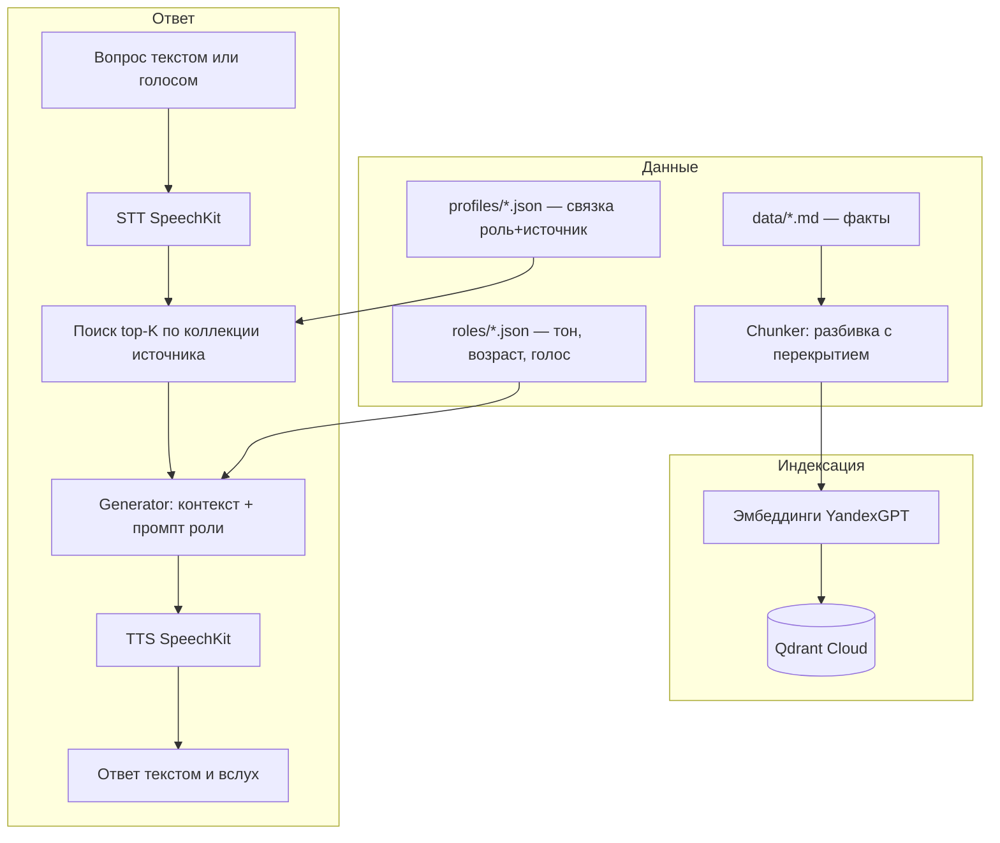

# RAG Knowledge Assistant

Конструктор RAG-ассистентов: один конвейер, любые базы знаний и любые роли ответа. Демонстрационная инстанция — голосовая энциклопедия динозавров: ребёнок задаёт вопрос голосом, ассистент находит ответ в энциклопедии и отвечает вслух.

## Что это

- Конструктор: база знаний (факты), роль (тон, возраст аудитории, голос) и профиль (связка роли с базой) — отдельные сущности, добавляются без изменения кода.
- Векторный поиск: эмбеддинги YandexGPT + Qdrant Cloud, косинусная близость, top-K с порогом отсечения.
- Голос: Yandex SpeechKit — распознавание вопроса (STT) и озвучка ответа (TTS).
- Интерфейсы: CLI и веб-приложение (Streamlit) с публичным демо.

## Архитектура



## Структура проекта

- data/ — базы знаний в markdown (dino_guide.md, merger_guide.md)
- roles/ — роли: имя ассистента, возраст аудитории, тон, длина ответа, стиль, fallback, голос
- sources/ — источники: файл базы и имя коллекции Qdrant
- profiles/ — профили: связки роль+источник с человекочитаемым названием
- src/ — конвейер: config, yandex_gpt_client, chunker, indexer, searcher, generator, speech, profile, main
- app.py — веб-интерфейс Streamlit: переключение профилей, чат, микрофон, озвучка
- tests/ — скрипт оценки качества поиска и результаты прогонов

## Быстрый старт

1. Клонируйте репозиторий и установите зависимости:
   ```bash
   pip install -r requirements.txt
   ```
2. Создайте .env по шаблону .env.template (ключи Yandex Cloud и Qdrant). Файл .env не публикуется.
3. Проиндексируйте базу:
   ```bash
   python src/main.py index --source dino_guide
   ```
4. Спросите через CLI:
   ```bash
   python src/main.py ask "тиранозавр страшный" --profile dinopedia
   ```
5. Или запустите веб-версию с голосом:
   ```bash
   streamlit run app.py
   ```

Публичное демо: [rag-dinopedia](https://rag-dinopedia.streamlit.app/).

## Профили

| Профиль | Роль | Источник | Аудитория |
| :--- | :--- | :--- | :--- |
| dinopedia | dino_friend, голос alena | dino_guide | ребёнок 5 лет, слушает на слух |
| dino_teen | teen_friend, голос filipp | dino_guide | подросток 12 лет |
| merger | business_expert, голос oksana | merger_guide | взрослый, рабочая документация |

## Как добавить свою энциклопедию

1. Положите markdown-файл в data/.
2. Опишите источник в sources/ (файл + имя коллекции).
3. Выберите роль из roles/ или создайте новую (тон, возраст, голос).
4. Создайте профиль в profiles/ (связка роль+источник).
5. Запустите индексацию источника. Код менять не нужно.

## Измерение качества

Поиск оценивается скриптом tests/evaluate.py на тестовом наборе вопросов с известными целевыми чанками. Базовая линия на базе merger_guide (9 чанков):

| Метрика | Значение |
| :--- | :---: |
| Accuracy@1 | 50% |
| Accuracy@3 | 70% |
| Above threshold | 80% |

Тестовый набор для dinopedia собирается из реальных вопросов ребёнка — это приёмочные сценарии продукта, а не синтетика.

## Challenges и решения

1. Нестабильная сеть и DNS провайдера: запросы к Yandex Cloud и Qdrant периодически обрывались. Решение — retry с экспоненциальными паузами во всех точках выхода в сеть; при полном сбое бот отвечает рольной fallback-фразой вместо ошибки.
2. 400 unknown model при выборе эмбеддинг-модели: документация описывала модели публичного облака, каталог организации отвечал иначе. Решение — перебор кандидатов против живого API и фиксация рабочей модели в коде с комментарием о способе подбора.
3. Галлюцинации LLM: жёсткий промпт роли, порог отсечения чанков по score, честный fallback при пустом контексте.
4. 401 на SpeechKit при рабочих LLM-запросах: сервису нужны отдельные роли сервисного аккаунта ai.speechkit-tts.user и ai.speechkit-stt.user.
5. Рассинхрон состояния Streamlit при переключении профилей: явный key у виджета и st.rerun() после смены профиля.

## Roadmap

- MAX-бот с голосовыми сообщениями: тот же продукт в мессенджере ребёнка.
- Re-ranking для роста Accuracy@1.
- Поддержка PDF и DOCX в chunker.
- Автоматический прогон оценки в CI.

## О ролях в проекте

Проект задуман как эксперимент BA-driven разработки: требования, данные, роли, приёмочные сценарии и метрики — от человека в роли бизнес-аналитика и продукт-владельца; код — от AI-ассистента по спецификации. Это осознанная схема работы, а не ограничение.

---
Автор: Кристина Цилик | [GitHub](https://github.com/Kris-Tsilik)